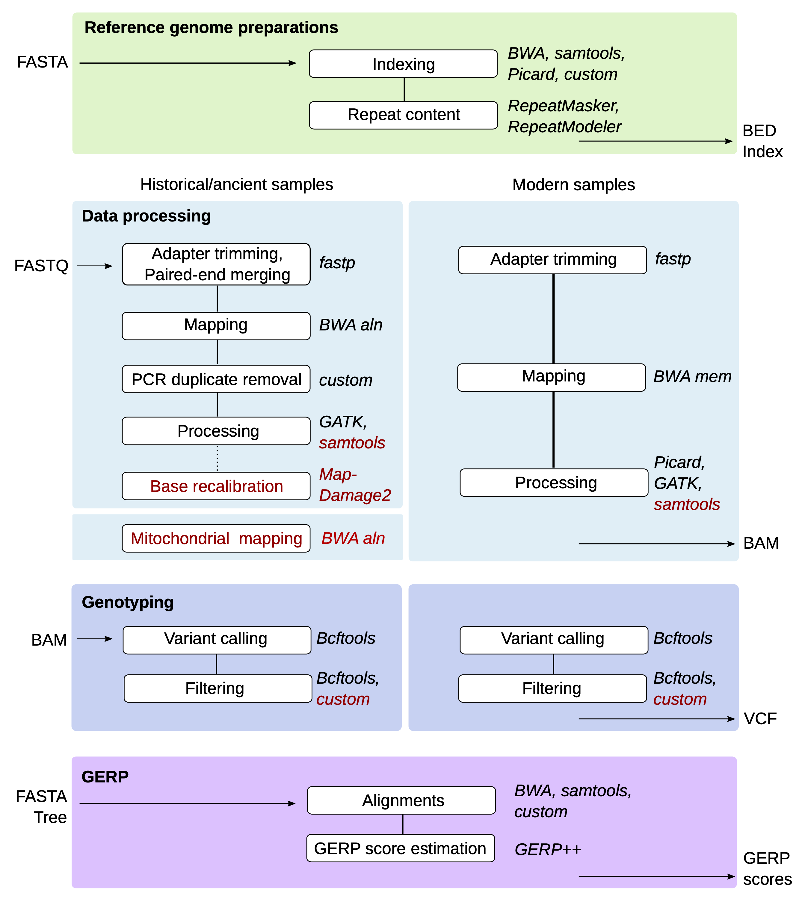

# GenErode pipeline

 

GitHub repository for GenErode, a Snakemake pipeline for the analysis 
of whole-genome sequencing data from historical and modern samples to 
study patterns of genome erosion.

## Documentation

The full pipeline documentation can be found on the [repository wiki](https://github.com/NBISweden/GenErode/wiki).

## Citation

If you've used GenErode to produce results, please cite our paper:

Kutschera VE, Kierczak M, van der Valk T, von Seth J, Dussex N, Lord E, Dehasque M, Stanton DWG, Emami P, Nystedt B, Dalén L, Díez-del-Molino D (2022) GenErode: a bioinformatics pipeline to investigate genome erosion in endangered and extinct species. BMC Bioinformatics 23, 228 https://doi.org/10.1186/s12859-022-04757-0

## Pipeline overview



Figure 1: Overview of the GenErode pipeline data processing tracks. Input 
and output files formats, dependencies between steps, and main software used
are shown. Optional steps are highlighted in red. 


Figure 2: Overview of the GenErode pipeline data analysis tracks and final reports.
Input file formats and main software used are shown.


## Licence information

GenErode pipeline

Copyright (C) 2022  Verena Kutschera

This program is free software: you can redistribute it and/or modify
it under the terms of the GNU General Public License as published by
the Free Software Foundation, either version 3 of the License, or
(at your option) any later version.

<<<<<<< HEAD
This program is distributed in the hope that it will be useful,
but WITHOUT ANY WARRANTY; without even the implied warranty of
MERCHANTABILITY or FITNESS FOR A PARTICULAR PURPOSE.  See the
GNU General Public License for more details.
=======
```
samplename_index_lane readgroup_id readgroup_platform path_to_R1_fastq_file path_to_R2_fastq_file
SfaABas001_Ex1_L3 HK7K2DSX3:3 illumina historical/Sfa-ABas_001_Ex1_L3_clmp.fp2_repr.R1.fq.gz historical/Sfa-ABas_001_Ex1_L3_clmp.fp2_repr.R1.fq.gz
SfaABas002_Ex1_L3 HK7K2DSX3:3 illumina historical/Sfa-ABas_002_Ex1_L3_clmp.fp2_repr.R1.fq.gz historical/Sfa-ABas_002_Ex1_L3_clmp.fp2_repr.R1.fq.gz
SfaABas003_Ex1_L3 HK7K2DSX3:3 illumina historical/Sfa-ABas_003_Ex1_L3_clmp.fp2_repr.R1.fq.gz historical/Sfa-ABas_003_Ex1_L3_clmp.fp2_repr.R1.fq.gz
SfaABas004_Ex1_L3 HK7K2DSX3:3 illumina historical/Sfa-ABas_004_Ex1_L3_clmp.fp2_repr.R1.fq.gz historical/Sfa-ABas_004_Ex1_L3_clmp.fp2_repr.R1.fq.gz
SfaABas005_Ex1_L3 HK7K2DSX3:3 illumina historical/Sfa-ABas_005_Ex1_L3_clmp.fp2_repr.R1.fq.gz historical/Sfa-ABas_005_Ex1_L3_clmp.fp2_repr.R1.fq.gz
SfaABas006_Ex1_L3 HK7K2DSX3:3 illumina historical/Sfa-ABas_006_Ex1_L3_clmp.fp2_repr.R1.fq.gz historical/Sfa-ABas_006_Ex1_L3_clmp.fp2_repr.R1.fq.gz
SfaABas007_Ex1_L3 HK7K2DSX3:3 illumina historical/Sfa-ABas_007_Ex1_L3_clmp.fp2_repr.R1.fq.gz historical/Sfa-ABas_007_Ex1_L3_clmp.fp2_repr.R1.fq.gz
SfaABas008_Ex1_L3 HK7K2DSX3:3 illumina historical/Sfa-ABas_008_Ex1_L3_clmp.fp2_repr.R1.fq.gz historical/Sfa-ABas_008_Ex1_L3_clmp.fp2_repr.R1.fq.gz
SfaABas009_Ex1_L3 HK7K2DSX3:3 illumina historical/Sfa-ABas_009_Ex1_L3_clmp.fp2_repr.R1.fq.gz historical/Sfa-ABas_009_Ex1_L3_clmp.fp2_repr.R1.fq.gz
```
>>>>>>> 77d17572a89e49540756e221d3ec28d4688f0510

You should have received a copy of the GNU General Public License
along with this program. If not, see <https://www.gnu.org/licenses/>.


<<<<<<< HEAD
Logo: Jonas Söderberg
=======
File format + header: samplename_index_lane readgroup_id readgroup_platform path_to_R1_fastq_file path_to_R2_fastq_file

```
samplename_index_lane readgroup_id readgroup_platform path_to_R1_fastq_file path_to_R2_fastq_file
SfaCBas001_Ex1_L3 HK7K2DSX3:3 illumina modern/Sfa-CBas_001_Ex1_L3_clmp.fp2_repr.R1.fq.gz modern/Sfa-CBas_001_Ex1_L3_clmp.fp2_repr.R1.fq.gz
SfaCBas002_Ex1_L3 HK7K2DSX3:3 illumina modern/Sfa-CBas_002_Ex1_L3_clmp.fp2_repr.R1.fq.gz modern/Sfa-CBas_002_Ex1_L3_clmp.fp2_repr.R1.fq.gz
SfaCBas003_Ex1_L3 HK7K2DSX3:3 illumina modern/Sfa-CBas_003_Ex1_L3_clmp.fp2_repr.R1.fq.gz modern/Sfa-CBas_003_Ex1_L3_clmp.fp2_repr.R1.fq.gz
SfaCBas004_Ex1_L3 HK7K2DSX3:3 illumina modern/Sfa-CBas_006_Ex1_L3_clmp.fp2_repr.R1.fq.gz modern/Sfa-CBas_006_Ex1_L3_clmp.fp2_repr.R1.fq.gz
SfaCBas007_Ex1_L3 HK7K2DSX3:3 illumina modern/Sfa-CBas_007_Ex1_L3_clmp.fp2_repr.R1.fq.gz modern/Sfa-CBas_007_Ex1_L3_clmp.fp2_repr.R1.fq.gz
SfaCBas008_Ex1_L3 HK7K2DSX3:3 illumina modern/Sfa-CBas_008_Ex1_L3_clmp.fp2_repr.R1.fq.gz modern/Sfa-CBas_008_Ex1_L3_clmp.fp2_repr.R1.fq.gz
SfaCBas009_Ex1_L3 HK7K2DSX3:3 illumina modern/Sfa-CBas_009_Ex1_L3_clmp.fp2_repr.R1.fq.gz modern/Sfa-CBas_009_Ex1_L3_clmp.fp2_repr.R1.fq.gz
```

Edit config file.

```
vi /home/e1garcia/shotgun_PIRE/pire_lcwgs_data_processing/salarias_fasciatus/1st_sequencing_run/GenErode_Sfa_test/config/config.yaml
```

Changes:
* line 23 - ref_path = "GCF_902148845.1_fSalaFa1.1_chr1-23-mtgen.fna"
* line 31 - historical_samples = "config/Sfa_9_historical_samples.txt"
* line 32 - modern_samples = "config/Sfa_7_modern_samples.txt" 
* line 109 - mapping = True
* line 165 - historical_bam_mapDamage = TRUE
* line 173 - historical_rescaled_samplenames = ["SfaABas001","SfaABas002","SfaABas003","SfaABas004","SfaABas005","SfaABas006","SfaABas007","SfaABas008","SfaABas009"]

### Try to run!

Copy and run the sbatch file.

```
cp /home/e1garcia/shotgun_PIRE/pire_lcwgs_data_processing/scripts/GenErode_Wahab/run_GenErode.sbatch /home/e1garcia/shotgun_PIRE/pire_lcwgs_data_processing/salarias_fasciatus/1st_sequencing_run/GenErode_Sfa_test

cd /home/e1garcia/shotgun_PIRE/pire_lcwgs_data_processing/salarias_fasciatus/1st_sequencing_run/GenErode_Sfa_test

sbatch run_GenErode.sbatch 
```
>>>>>>> 77d17572a89e49540756e221d3ec28d4688f0510
