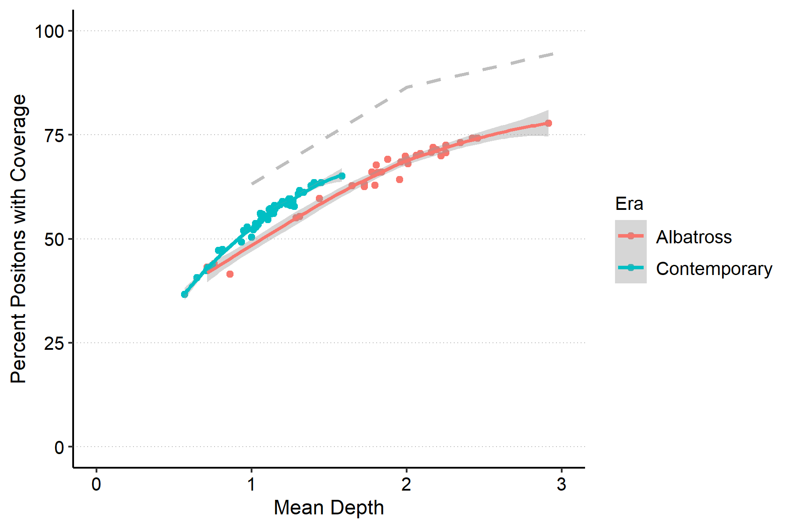

# Salarias fasciatus lcwgs

---

Jordan Rodriguez

---
This repository outlines the roadmap we followed to move *Salarias fasciatus* through the [Low Coverage Whole Genome Sequencing Pipeline](https://github.com/philippinespire/pire_lcwgs_data_processing) and the analysis we did in order to gain insight on the historical population demography of this popular aquarium fish species, also known as the jewelled blenny. 

---

## 1. Preprocessing FqGZ files

I followed the [pire_fq_gz_processing](https://github.com/philippinespire/pire_fq_gz_processing) instructions and scripts
At the second fastp, we noticed a motif in the first 14 bp of the reads, so we split the data into 2 paths

* fp2: not clipping the first 14 bp
* fp2b: clipping off the first 14 bp

---

## 2. Getting only the Chromosomes and mtGenome from the Genome Download

```bash
# Download the genome 
wget https://ftp.ncbi.nih.gov/genomes/refseq/vertebrate_other/Salarias_fasciatus/all_assembly_versions/GCF_902148845.1_fSalaFa1.1/GCF_902148845.1_fSalaFa1.1_genomic.fna.gz

# get the line num for every chrom, contig, and scaffold in the genome download and save to file
zgrep -n '^>' GCF_902148845.1_fSalaFa1.1_genomic.fna.gz > GCF_902148845.1_fSalaFa1.1_genomic_linenums.txt

# get mitogenome, which starts on line 9968937, and save to file
zcat GCF_902148845.1_fSalaFa1.1_genomic.fna.gz | tail -n +9968937 > NC_004412.1_mtgenome.fasta

# get chromes 1-7 and save to file
zcat GCF_902148845.1_fSalaFa1.1_genomic.fna.gz | head -n 3077487 > NC_043745.1-NC_043751.1_chr1-7.fasta

# get chromes 8-23, theres no 21, and save to file
zcat GCF_902148845.1_fSalaFa1.1_genomic.fna.gz | tail -n +3431318 | head -n 5857623 > NC_043752.1-NC_043766.1_chr8-23.fasta

# concatenating and gzipping the chromosomes and mitogenome into one file
cat NC_043745.1-NC_043751.1_chr1-7.fasta NC_043752.1-NC_043766.1_chr8-23.fasta NC_004412.1_mtgenome.fasta | gzip > GCF_902148845.1_fSalaFa1.1_chr1-23-mtgen.fna.gz
```

---

## 3. Mapping & Filtering Bams

I followed the [pire_lcwgs_data_processing](https://github.com/philippinespire/pire_lcwgs_data_processing) repo instructions

After step 5. 'Filter the binary alignment maps', separate the filtered bam files from the raw bam files.

```bash 
 cd /home/e1garcia/shotgun_PIRE/pire_lcwgs_data_processing/salarias_fasciatus
 mkdir fltrBAM
 mv mkBAM/*fltrd* fltrBAM/
```

---

## 4. Sequencing Calculations 

I cloned [rroberts_thesis](https://github.com/cbirdlab/rroberts_thesis) into `/home/e1garcia/shotgun_PIRE/` on wahab.hpc.odu.edu server to make the [`mappedReadStats.sbatch`](https://github.com/cbirdlab/rroberts_thesis/blob/main/scripts/bam_processing/mappedReadStats.sbatch) script easily accessible from any species directory.

I followed the [read_mapping_summary](https://github.com/cbirdlab/read_mapping_summary) section B. repo instructions.

Here are the visual results:




--- 

## 5. Make a PopMap File

We need to make a popmap file that has 2 columns, populationID and IndiviudalID, here we use the filtered bam files and some bash commands to make the popmap.

```bash
bash
paste <( ls fltrBAM/*bam | sed -e 's/^.*\///' -e 's/_.*$//' ) <( ls fltrBAM/*bam | sed -e 's/^.*\///' -e 's/_L[1-8]_.*bam$//' -e 's/_Ex[1-9].*$//' ) > fltrBAM/popmap_sfa.tsv
```

---

## 6. Convert the Filtered BAM Files to a Beagle File Using Angsd

It is important to note that there are stringent default filters that are employed by Angsd during the creation of the beagle file, which will remove data that we do not want to remove. To navigate this, we made `mkBGL.sbatch`, where we ran a series of 6 tests ranging from lenient to stringent filtering. The last assigned `TODO` and `FILTERS` are the parameters that will be applied when the script is ran. Optimally, you should only have to make two beagle files; the first beagle file gives insight to the appropriate filter parameters needed for the second and final beagle file. You may need to make additional beagle files if the filters need to be adjusted. 

### a. Make beagle file with minimal filters 

You must first minimally filter the data so that you can accurately set the filter parameters for the final beagle file. 

To make the minimally filtered beagle file, run the `mkBGL.sbatch` script with minimal `TODO` and `FILTERS` settings. Here is the code I used when making the `initial.beagle.gz` file: 
```bash
# done on USER@wahab.hpc.odu.edu
cd /home/e1garcia/shotgun_PIRE/pire_lcwgs_data_processing/salarias_fasciatus
# Angsd outputs files to the mkBGL dir, so it may be usefiul to create this dir before running the script if you haven't already
mkdir mkBGL
# $1=fltrBAMdir $2=outPREFIX
sbatch scripts/mkBGL.sbatch fltrBAM Sfa-ABas-CBas_all_initial
```
When running the above code again for the final beagle file, make sure to replace "initial" to "final" when naming the prefix.  

*Note: check the `.args` and the `.err` files to see what filters were applied to the run (double check that the ones you indicated are the ones listed), and which errors might have occurred during the run*

*Soon, we will be creating files for the `initial_bgl_filters` and `final_bgl_filters` for them to be fed to the script instead of hardcoded -- coming soon*

### b. Determine final `mkBGL.sbatch` settings

Now that we have a minimally filtered beagle file, we can begin to visualize this data in order to determine the final filter settings. To do this, We first subsetted the `snpStat.gz` out file for easier handling and faster visualization in R using the following code for each test:

```bash
# here, we take only the first 100000 rows of our data and redirect that into a new file
zcat Sfa-ABas-CBas_all_initial.snpStat.gz | head -n 100000 > Sfa-ABas-CBas_all_initial.100k.snpStat
```

Next, edit the `.gitignore` file located in the parent dir to allow the subsetted txt file through when pushing changes. Pull the changes to your local computer and open the `processSnpStat.R` script.

You are now in the R environment:

After loading the needed librarys and data, make sure to change the `numInd` and `minInd` to the appropriate values for your dataset. Here, we use 81 and 41.
```R
numInd=81
minInd=41
```
This script will output a series of 12 plots: Positive Strand Read Counts, Negative Strand Read Counts, Positive Strand Minor AF, Negative Strand Minor AF, Strand Bias 1, Strand Bias 2, Strand Bias 3, HWE P Value, Base Quality P Value, Mapping Quality P Value, Edge P Value, and Het Stat P Value.

These plots, along with the PCA plots (created in step. 8), helped us to determine the final beagle file parameters needeed. If you are not satisfied with the plots, return to the `mkBGL.sbatch` script and modify the filters at this time. Continue to change the settings until you are satisfied.

---

## 7. Run [PCAngsd](http://popgen.dk/software/index.php/PCAngsd) : `runPCANGSD_selection_maptest.sbatch`

After following Demo 1 and 2 of the [PCAngsd tutorial](http://popgen.dk/software/index.php/PCAngsd), we created `runPCANGSD_selection_maptest`. The objective is to use PCAngsd to estimate the covariance matrix while jointly estimating the individual allele frequencies. 

Run `runPCANGSD_selection_maptest.sbatch` on the beagle file. Here is the code I used for the initial beagle file:
```bash
$1= InBGL $2=outDIR $3=outFilePREFIX $4=minMaf 
sbatch scripts/runPCANGSD_selection_maptest.sbatch ./mkBGL/Sfa-ABas-CBas_all_initial.beagle.gz ./PCAngsd_selection  Sfa-ABas-CBas_all_initial_PCAngsd_selection_maptest 0.05
```

After the script finishes running, view the `.out` file and report the # SNPs retained and # Principal Components. Here are the stats for the tests we ran (minMaf 0.05):

| test##             | # SNPs retained | # Principal Components |
|--------------------|-----------------|------------------------|
| test 01 (initial)  |     13345151    |            1           |
| test 02            |     7876119     |            1           |
| test 03            |     7780498     |            1           | 
| test 04            |     701713      |            1           |
| test 05            |     2772817     |            1           |
| test 06 (final)    |     560777      |            1           | 

---

## 8. Visualize results using `plotPCANGSD_selection.R`

Pull changes to your local computer and open `plotPCANGSD_selection.R` in Rstudio.

We wanted to see the various PCAs for our initial beagle file (and subsequently the final beagle file), so we read in the `.cov` file and the `popmap_sfa.tsv` file, and skipped to the portion titiled `#### READ IN PCA DATA ####`. Run everything from here down.

3 resulting PCAs are generated. If you are not satisfied with the PCA plots, return to step 6. and filter the data further until you are satisfied. Ideally, you'll want to move on to step 9. with ONLY the final beagle file. The final beagle file for *Salarias fasciatus* is named Sfa-ABas-CBas_all_final.beagle.gz

---

## 9. Filter the Beagle File: Removing sites that dont pass

run `findSitesWithMinIndPerPop.bash`

```bash
cd /home/e1garcia/shotgun_PIRE/pire_lcwgs_data_processing/salarias_fasciatus
$1=inFILE $2=outFILE
sbatch scripts/findSitesWithMinIndPerPop.bash mkBGL/Sfa-ABas-CBas_all_final.geno.gz mkBGL/Sfa-ABas-CBas_all_final.minIndPerPop20.sites
```
This will output a `.sites` file that describes sites where there at least 20 individualts per pop. This file will be used for argument 2 of `fltrBGL2.sbatch`. See code. 

run `fltrBGL2.sbatch`

```bash 
$1=bglFile $2=sitesFile
sbatch scripts/fltrBGL2.sbatch mkBGL/Sfa-ABas-CBas_all_final.beagle.gz mkBGL/Sfa-ABas-CBas_all_final.minIndPerPop20.sites
```
This will output a `*_fltrd.beagle.gz` file that can be used in step 10. Run `runPCANGSD_selection_maptest.sbatch` on the filtered data. 

---

## 10. Run `runPCANGSD_selection_maptest.sbatch` on filtered data

Here, I ran `runPCANGSD_selection_maptest.sbatch` on the final filtered data with minMaf = 0.05, 0.0, 0.1, 0.2, and 0.3. This is the code I ran with a minMaf = 0.05:

```bash 
$1= InBGL $2=outDIR $3=outFilePREFIX $4=minMaf 
sbatch scripts/runPCANGSD_selection_maptest.sbatch ./mkBGL/Sfa-ABas-CBas_all_final_fltrd.beagle.gz ./PCAngsd_selection Sfa-ABas-CBas_all_final_fltrd_maptest 0.05 
```
Here are the `.out` file stats for Sfa-ABas-CBas_all_final_fltrd_maptest with different minMaf settings: 

|  minMaf  | # SNPs retained | # Principal Components |
|----------|-----------------|------------------------|
|   0.0    |     2184249     |            1           |
|   0.05   |     505308      |            1           |
|   0.1    |     287167      |            1           | 
|   0.2    |     145575      |            1           |
|   0.3    |     78719       |            1           | 

Now, return to the instructions in step 8. and visualize the plots for the filtered data using `plotPCANGSD_selection.R`

---

## 11. Run `runPCANGSD_selection_maptest.sbatch` on filtered data by chromosome:

To observe the principle component analyses per chromosome, we first renamed the rows of `final_fltrd.beagle.gz` file from the NCBI chromosome identification starting with "NC_" to something more intuitive: "CHR01_, CHR02_, ..."

I named the new beagle file Sfa-ABas-CBas_all_final_fltrd_rnmd.beagle

### a. Making bgl for each chromosome 
```bash
done on USER@wahab.hpc.odu.edu
cd /home/e1garcia/shotgun_pire/pire_lcwgs_data_processing/salarias_fasciatus/mkBGL

#CHR01:
cat <(zcat Sfa-ABas-CBas_all_final_fltrd_rnmd.beagle.gz | \
head -n1) <(zcat Sfa-ABas-CBas_all_final_fltrd_rnmd.beagle.gz | \
grep "^CHR01") | \
gzip > CHR01.beagle.gz


#CHR02:
cat <(zcat Sfa-ABas-CBas_all_final_fltrd_rnmd.beagle.gz | \
head -n1) <(zcat Sfa-ABas-CBas_all_final_fltrd_rnmd.beagle.gz | \
grep "^CHR02") | \
gzip > CHR02.beagle.gz
```
all of the new beagle files will output to the mkBGL dir. 

### b. Running PCAngsd on each beagle 

following the code in step 7., we ran `runPCANGSD_selection_maptest.sbatch` on each chromosome beagle file. Here is the code I used for the first chromosome:

```bash
$1= InBGL $2=outDIR $3=outFilePREFIX $4=minMaf 
sbatch scripts/runPCANGSD_selection_maptest.sbatch ./mkBGL/CHR01.beagle.gz ./PCAngsd_selection  CHR01_PCAngsd_selection_maptest 0.05
```

### c. Visualize the results using `plotPCAngsd_selection.R`. 

Pull changes to your local computer and follow step 8. visualize the scree plot and all three PCAs for each chromosome. The script allows you to save these as either .png files or as pdfs, if you wish to save these plots.  


---


 
