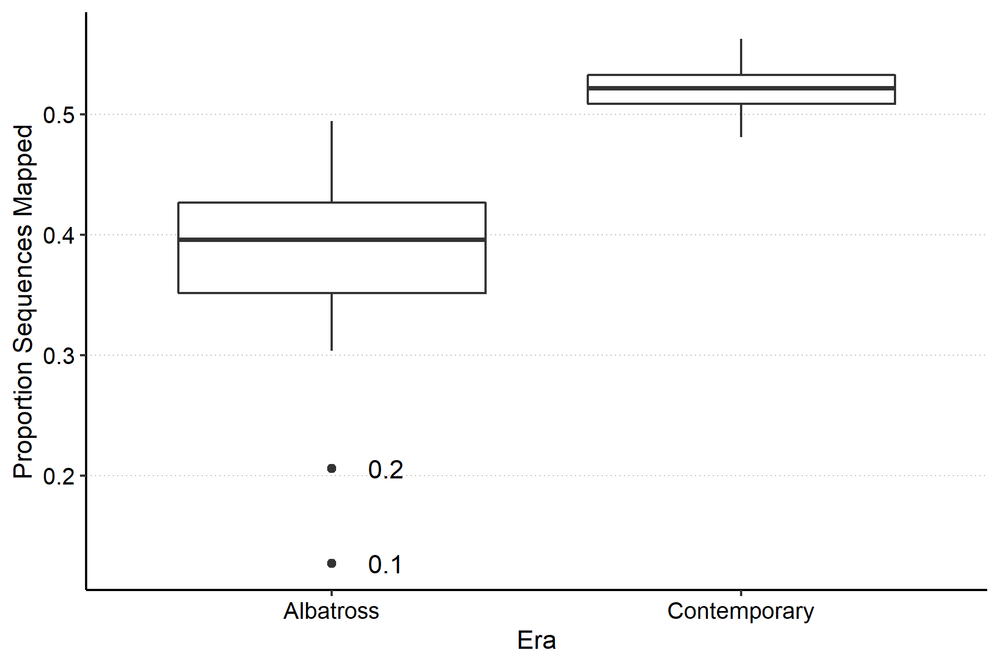

# Salarias fasciatus lcwgs

Jordan Rodriguez

---

## 1. Preprocessing FqGZ files

I followed the [pire_fq_gq_processing](https://github.com/philippinespire/pire_fq_gz_processing) instructions and scripts

At the second fastp, we noticed a motif in the first 14 bp of the reads, so we split the data into 2 paths

* fp2: not clipping the first 14 bp
* fp2b: clipping off the first 14 bp

---

## 2. Getting only the Chromosomes and mtGenome from the Genome Download

```bash
# Download the genome 
wget https://ftp.ncbi.nih.gov/genomes/refseq/vertebrate_other/Salarias_fasciatus/all_assembly_versions/GCF_902148845.1_fSalaFa1.1/GCF_902148845.1_fSalaFa1.1_genomic.fna.gz

# get the line num for every chrom, contig, and scaffold in the genome download and save to file
zgrep -n '^>' GCF_902148845.1_fSalaFa1.1_genomic.fna.gz > GCF_902148845.1_fSalaFa1.1_genomic_linenums.txt

# get mitogenome, which starts on line 9968937, and save to file
zcat GCF_902148845.1_fSalaFa1.1_genomic.fna.gz | tail -n +9968937 > NC_004412.1_mtgenome.fasta

# get chromes 1-7 and save to file
zcat GCF_902148845.1_fSalaFa1.1_genomic.fna.gz | head -n 3077487 > NC_043745.1-NC_043751.1_chr1-7.fasta

# get chromes 8-23, theres no 21, and save to file
zcat GCF_902148845.1_fSalaFa1.1_genomic.fna.gz | tail -n +3431318 | head -n 5857623 > NC_043752.1-NC_043766.1_chr8-23.fasta

# concatenating and gzipping the chromosomes and mitogenome into one file
cat NC_043745.1-NC_043751.1_chr1-7.fasta NC_043752.1-NC_043766.1_chr8-23.fasta NC_004412.1_mtgenome.fasta | gzip > GCF_902148845.1_fSalaFa1.1_chr1-23-mtgen.fna.gz
```

---

## 3. Mapping & Filtering Bams

I followed the [pire_lcwgs_data_processing](https://github.com/philippinespire/pire_lcwgs_data_processing) repo instructions

After step 5. 'Filter the binary alignment maps', separate the filtered bam files from the raw bam files.

```bash 
 cd /home/e1garcia/shotgun_PIRE/pire_lcwgs_data_processing/salarias_fasciatus
 mkdir fltrBAM
 mv mkBAM/*fltrd* fltrBAM/
```

---

## 4. Sequencing Calculations 

I cloned [rroberts_thesis](https://github.com/cbirdlab/rroberts_thesis) into `/home/e1garcia/shotgun_PIRE/` on wahab.hpc.odu.edu server to make the [`mappedReadStats.sbatch`](https://github.com/cbirdlab/rroberts_thesis/blob/main/scripts/bam_processing/mappedReadStats.sbatch) script easily accessible from any species directory.

I followed the [read_mapping_summary](https://github.com/cbirdlab/read_mapping_summary) section B. repo instructions.

Here are the visual results:




--- 

## 5. Convert the Filtered BAM Files to a Beagle File Using Angsd

To make the beagle file, you can use the `mkBGL.sbatch` script which accepts the directory with the filtered BAM files and a gzipped reference genome. The script will make a bgzipped reference genome and an fai index file. If a valid bgzipped reference genome and matching fai index file already exists, then mkBGL.sbatch accepts the bgzipped reference genome. 

```bash
# login to user@wahab.hpc.odu.edu
cd /home/e1garcia/shotgun_PIRE/pire_lcwgs_data_processing/salarias_fasciatus

# angsd outputs files to the present directory, so it's best to create an out dir and move there
mkdir mkBGL
cd mkBGL

# sbatch mkBGL.sbatch FilteredBamDir GzippedRefGenome
sbatch ../../mkBGL.sbatch fltrBAM GCF_902148845.1_fSalaFa1.1_chr1-23-mtgen.fna.gz
```

It's a good idea to name the beagle file descriptively, so that it is easy to know the data that it contains.  Here, we used all filtered Sfa BAM files to make the beagle file.

```bash
mv mkBGL.beagle.gz Sfa-ABas-CBas_all-GCF_902148845.1_fSalaFa1.1_chr1-23-mtgen_clmp_fp2_repr_fltrd.beagle.gz

# if the file name is unweildy, such as the one above you could store it in an enviromental variable to make it easier to use later
# you may need to enter bash for the following command to work
bglFile=Sfa-ABas-CBas_all-GCF_902148845.1_fSalaFa1.1_chr1-23-mtgen_clmp_fp2_repr_fltrd.beagle.gz
```

---

## 6. Make a PopMap File

We need to make a popmap file that has 2 columns, populationID and IndiviudalID, here we use the filtered bam files and some bash commands to make the popmap.

```bash
bash
paste <( ls fltrBAM/*bam | sed -e 's/^.*\///' -e 's/_.*$//' ) <( ls fltrBAM/*bam | sed -e 's/^.*\///' -e 's/_L[1-8]_.*bam$//' -e 's/_Ex[1-9].*$//' ) > fltrBAM/popmap_sfa.tsv
```

## 7. Run [PCAngsd](http://popgen.dk/software/index.php/PCAngsd)

Tutorial: [http://www.popgen.dk/software/index.php/PCAngsdTutorial](http://www.popgen.dk/software/index.php/PCAngsdTutorial)

The path to file that you have now intuitively renamed above will need to be set as the first argument in the command line when running the `runPCANGSD.sbatch` script.  Make sure you've completed the previous step and you've saved the name of the beagle file into a variable named `bglFile`. The second and third arguments will create the out directory and the prefix to the out files.

```bash
# login to user@wahab.hpc.odu.edu
cd /home/e1garcia/shotgun_PIRE/pire_lcwgs_data_processing/salarias_fasciatus
# $1=bglFile $2=OUTDIR $3=OUT_PREFIX
sbatch runPCANGSD.sbatch ./mkBGL/$bglFile ./PCAngsd out_PCAngsd
```

---

## 8. Wrangle Output from PCAngsd and Visualize Results

When PCAngsd is complete you can use `processPCAngsd_out.R` to visualize the results

But first, you have to make sure the correct packages are installed

```bash
enable_lmod
module load container_env ngsTools
module load R/4.1.3
crun R
```

You are now in the R environment

```R
install.packages("tidyverse")  #this takes a while
# say yes, and yes again,
# if you have xming turned on an working (windows subsystem linux on windows) then a window will pop up, select first option, otherwise,
# use mirror 1, say yes, wait for this to finish

install.packages("RcppCNPy")
```


```bash
cd /home/e1garcia/shotgun_PIRE/pire_lcwgs_data_processing/salarias_fasciatus
Rscript ../processPCAngsd_out.R PCAngsd/out_PCAgsd.cov PCAngsd/out_PCAgsd.selection.npy PCAngsd/out_PCAgsd.maf.npy fltrBAM/popmap_sfa.tsv   
```

add visual here 

---

## 9. Run Variants of PCAngsd 

In your species directory, make a copy of the runPCANGSD.sbatch script and appropriately name it.
```bash
# login to user@wahab.hpc.odu.edu
cd /home/e1garcia/shotgun_PIRE/pire_lcwgs_data_processing/salarias_fasciatus
less runPCANGSD.sbatch # copy code
nano runPCANGSD_allelefreq.sbatch # paste code & edit
# edit the script as needed and save the script
```

When applying different aspects of the [PCAngsd tutorial](http://www.popgen.dk/software/index.php/PCAngsdTutorial) to your dataset, run the scripts from the species directory; the script will generate the out directory that you name as the second argument in the command line.

I made intuitively named copies of the `runPCANGSD.sbatch` script and similarly named the paired out directory for the below PCAngsd variants.

Estimating Individual Allele Frequencies : `runPCANGSD_allelefreq.sbatch`
```bash
cd /home/e1garcia/shotgun_PIRE/pire_lcwgs_data_processing/salarias_fasciatus
# $1=bglFile $2=OUTDIR $3=OUT_PREFIX
sbatch runPCANGSD_allelefreq.sbatch ./mkBGL/$bglFile ./PCAngsd_allelefreq out_PCAngsd_allelefreq
```

Without Estimating Individual Allele Frequencies : `runPCANGSD_noallelefreq.sbatch`
```bash
cd /home/e1garcia/shotgun_PIRE/pire_lcwgs_data_processing/salarias_fasciatus
sbatch runPCANGSD_noallelefreq.sbatch ./mkBGL/$bglFile ./PCAngsd_noallelefreq out_PCAngsd_noallelefreq
```

Admixture based on two PC : `runPCANGSD_admix.sbatch`
```bash
cd /home/e1garcia/shotgun_PIRE/pire_lcwgs_data_processing/salarias_fasciatus
sbatch runPCANGSD_admix.sbatch ./mkBGL/$bglFile ./PCAngsd_admix out_PCAngsd_admix
```

Inbreeding in the admixed individuals : `runPCANGSD_inbred_admix.sbatch`
```bash
cd /home/e1garcia/shotgun_PIRE/pire_lcwgs_data_processing/salarias_fasciatus
sbatch runPCANGSD_inbred_admix.sbatch ./mkBGL/$bglFile ./PCAngsd_inbred_admix out_PCAngsd_inbred_admix
```

Inbreeding with individual allele frequencies : `runPCANGSD_inbred_allelefreq.sbatch`
```bash
cd /home/e1garcia/shotgun_PIRE/pire_lcwgs_data_processing/salarias_fasciatus
sbatch runPCANGSD_inbred_allelefreq.sbatch ./mkBGL/$bglFile ./PCAngsd_inbred_allelefreq out_PCAngsd_inbred_allelefreq
```

---

## 10. Wrangle Outputs from PCAngsd Variants and Visualize Results

Make sure the correct packages are installed

```bash
enable_lmod
module load container_env ngsTools
module load R/4.1.3
crun R
```

```R
install.packages("tidyverse")  #this takes a while
# say yes, and yes again,
# if you have xming turned on an working (windows subsystem linux on windows) then a window will pop up, select first option, otherwise,
# use mirror 1, say yes, wait for this to finish

install.packages("RcppCNPy")
```
Estimating Individual Allele Frequencies: `plotPCANGSD_allelefreq.R`

The `.tsv` pop map created above and the `.cov` out file from `runPCANGSD_allelefreq.sbatch` script were read into the `plotPCANGSD_allelefreq.R` script

Here were the results: 

PC1 v PC2 


PC1 v PC3


PC2 v PC3


 
